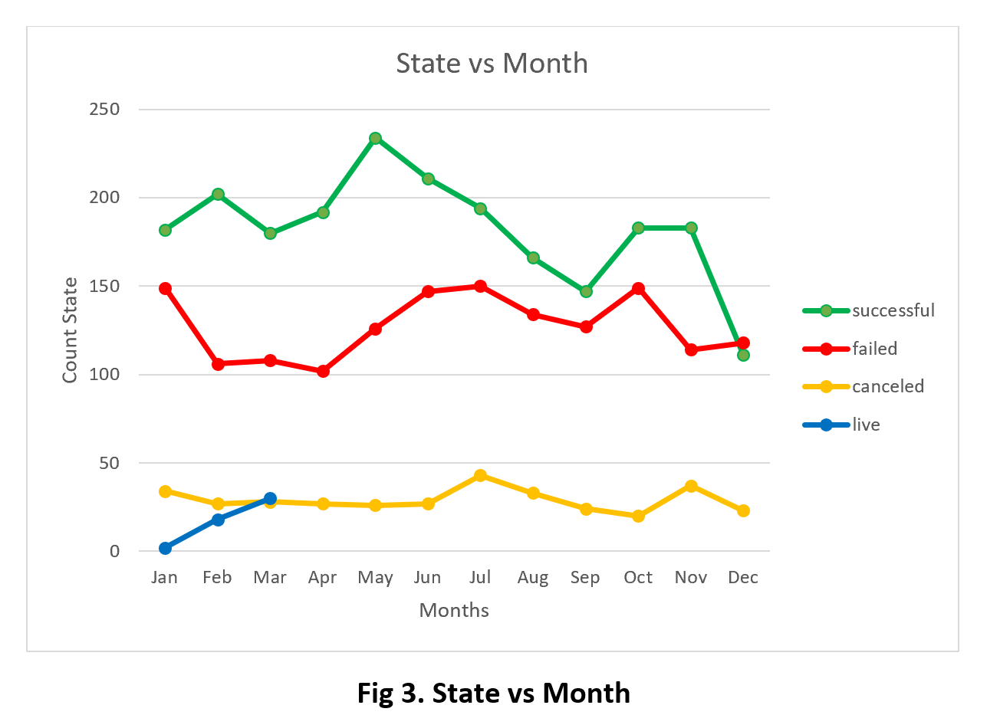

# KickStart Analysis

######The Objective of this project was to organize and analyze a database of 4,000 past projects in order to uncover any hidden trends.

#### Analysis:

######1.The most popular applications at Kickstarter are those related to theater, followed by music and technology, which have 1393, 700 and 600 projects, respectively (Fig 1.). For these top 3 categories, it can be observed that for theater and music are more the projects that have success rather than those that are failed, or even canceled; and between both, in terms of proportion, music has the higher rate. It is important to highlight the behavior of technology applications, which has a similar proportion between successful, failed, or canceled projects.  Additionally, it is worth mentioning that there are not successful projects for journalism, all 24 projects seen on the chart were canceled. 

######2.Following the below trend (Fig 2.), it can be evidenced that the most desired sub-category is “plays”, which has coherence based on the above theater category tendency. It can be also observed that sub-categories such as rock, classical music, and metal, are representing only successful projects; and this can justify the above music proportion tendency as well.

######3.Now, analyzing the State behavior versus Months (Fig 3.), it can be said that May is the month which has more successful projects, and December is the one with less success. Following the trend, there is an interesting continuous drop within successful applications from May to September. This can be considered as good criteria for organizations that want to apply on any initiative.

